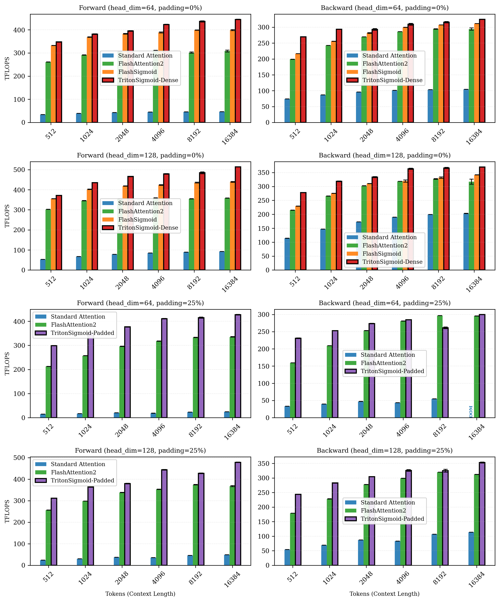

# Benchmarking Guide

## Running Benchmarks

### Quick Benchmark

```bash
python benchmarks/benchmark_sigmoid.py \
  --dtype bf16 \
  --mode both \
  --providers triton-dense triton-padded torch \
  --head-dims 64 128 \
  --seq-lens 512 1024 2048 4096 \
  --padding-pcts 0 25
```

### Full Benchmark

```bash
python benchmarks/benchmark_sigmoid.py \
  --dtype bf16 \
  --mode both \
  --providers triton-dense triton-padded torch \
  --head-dims 64 128 \
  --seq-lens 512 1024 2048 4096 8192 16384 \
  --padding-pcts 0 25 50 \
  --warmup 100 \
  --rep 250 \
  --return-mode all \
  --output-dir results/
```

## Available Providers

- `triton-dense`: Dense kernel (padding=0 only, fastest for same-length sequences)
- `triton-padded`: Padded kernel (padding>0, variable-length sequences)
- `torch`: PyTorch reference implementation
- `flash_sigmoid`: Flash Sigmoid (if installed, padding=0 only)
- `flash_attn`: Flash Attention (if installed)

## Results



Benchmarked on NVIDIA H100 80GB with bfloat16.

## Options

- `--dtype`: float16, bfloat16, float32
- `--mode`: fwd, bwd, both
- `--providers`: triton-dense, triton-padded, torch, flash_sigmoid, flash_attn
- `--head-dims`, `--seq-lens`, `--padding-pcts`: test configurations
- `--warmup`, `--rep`: iteration counts
- `--output-dir`: save directory
